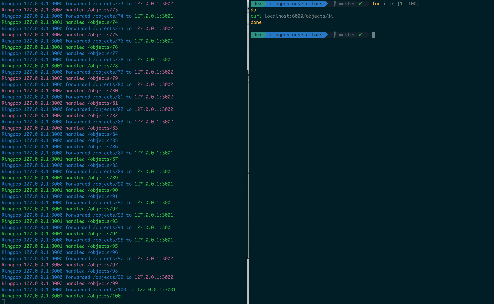

Ringpop Example
---------------

Copypasta of the nodejs [Ringpop](https://eng.uber.com/intro-to-ringpop/) example at [Programming Ringpop](https://github.com/uber/ringpop-common/blob/master/docs/programming_ringpop.md#an-example-express-app), but with some extra coloring and logging. This is a product of attempts to better visualize Ringpop in action.

Running
--------

Only tested on node `0.10.32`. Once you have that:

```sh
npm install
node example.js
```

Then, in another terminal, run the curl test:

```sh
./test.sh
```

You should see some output colored by host:





License
--------

MIT
